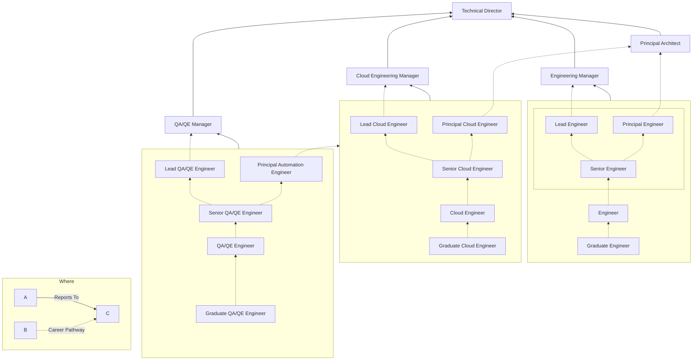

```mermaid
flowchart BT
  subgraph report_em [ ]
    direction BT

    pe[Principal Engineer]
    le[Lead Engineer]
    se[Senior Engineer]
    e[Engineer]
    ge[Graduate Engineer]

    ge -.-> e
    e -.-> se

    subgraph stream_lead [ ]
      direction BT

      se -.-> pe
      se -.-> le
    end
  end

  subgraph report_cem [ ]
    direction BT

    pce[Principal Cloud Engineer]
    lce[Lead Cloud Engineer]
    sce[Senior Cloud Engineer]
    ce[Cloud Engineer]
    gce[Graduate Cloud Engineer]

    gce -.-> ce
    ce -.-> sce
    sce -.-> pce
    sce -.-> lce
  end

  subgraph report_qam [ ]
    direction BT

    lqe[Lead QA/QE Engineer]
    pae[Principal Automation Engineer]
    sqe[Senior QA/QE Engineer]
    qe[QA/QE Engineer]
    gqe[Graduate QA/QE Engineer]

    gqe -.-> qe
    qe -.-> sqe
    sqe -.-> pae
    sqe -.-> lqe
  end

  pae -.-> report_cem
  le -.-> em
  lce -.-> cem
  lqe -.-> qam

  td[Technical Director]
  pa[Principal Architect]
  em[Engineering Manager]
  cem[Cloud Engineering Manager]
  qam[QA/QE Manager]

  report_em --> em
  report_cem --> cem
  report_qam --> qam
  pe -..-> pa
  pce -..-> pa

  pa --> td
  em --> td
  cem --> td
  qam --> td

  subgraph legend [Where]
    direction LR

    A -->|Reports To| C
    B -.->|Career Pathway| C
  end  
```