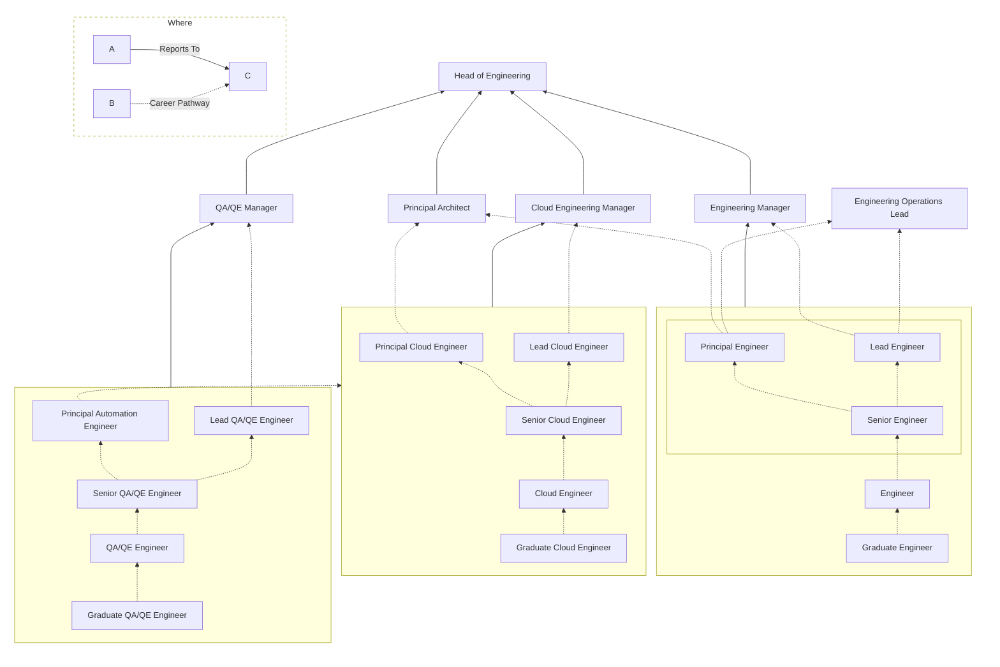

```mermaid
flowchart BT
  subgraph band_td [ ]
    direction LR
    
    td[Head of Engineering]

    subgraph legend [Where]
      direction LR

      A -->|Reports To| C
      B -.->|Career Pathway| C
    end  
  end

  subgraph band_mgmt [ ]
    direction LR

    pa[Principal Architect]
    em[Engineering Manager]
    cem[Cloud Engineering Manager]
    qam[QA/QE Manager]
    eol[Engineering Operations Lead]
  end

  subgraph band_teams [ ]
    direction LR

    subgraph report_em [ ]
      direction BT

      pe[Principal Engineer]
      le[Lead Engineer]
      se[Senior Engineer]
      e[Engineer]
      ge[Graduate Engineer]

      ge -.-> e
      e -.-> se

      subgraph stream_lead [ ]
        direction BT

        se -.-> pe
        se -.-> le
      end
    end

    subgraph report_cem [ ]
      direction BT

      pce[Principal Cloud Engineer]
      lce[Lead Cloud Engineer]
      sce[Senior Cloud Engineer]
      ce[Cloud Engineer]
      gce[Graduate Cloud Engineer]

      gce -.-> ce
      ce -.-> sce
      sce -.-> pce
      sce -.-> lce
    end

    subgraph report_qam [ ]
      direction BT

      lqe[Lead QA/QE Engineer]
      pae[Principal Automation Engineer]
      sqe[Senior QA/QE Engineer]
      qe[QA/QE Engineer]
      gqe[Graduate QA/QE Engineer]

      gqe -.-> qe
      qe -.-> sqe
      sqe -.-> pae
      sqe -.-> lqe
    end
  end

  pae -.-> report_cem
  le -.-> em
  le -.-> eol
  lce -.-> cem
  lqe -.-> qam

  report_em --> em
  report_cem --> cem
  report_qam --> qam
  pe -..-> pa
  pe -.-> eol
  pce -..-> pa

  pa --> td
  em --> td
  cem --> td
  qam --> td

  classDef band fill:transparent,stroke:none;
  class band_td,band_mgmt,band_teams band;
  style legend fill:transparent,stroke-dasharray:5;
```