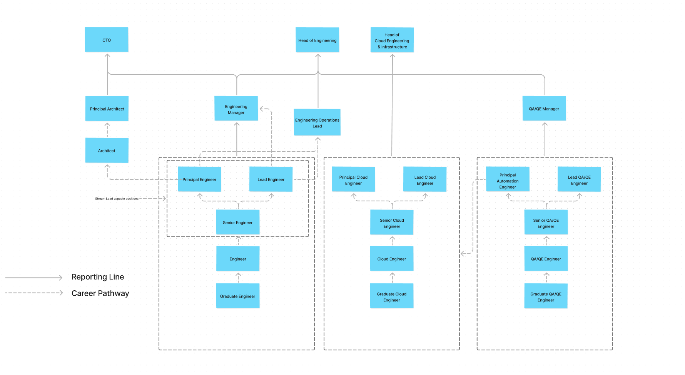

# Loan Market Group Technology Ladder

This repository describes the technical roles within the group.

It seeks to describe some **defining characteristics** about each role, and provide some concrete **examples** along the way. Each example should be both **attainable** and **reasonable** to expect of a team member in that role, but overall the collection should be treated as **aspirational**. It is most important that an individual exhibits the broad **attitude** and **behaviour** described.

It's the anchor point used through all of our feedback and promotion cycles. This is a living set of documents, maintained by the very people it affects.

## Roles

[Engineering Roles](Engineering.md)

[Cloud Engineering Roles](Cloud.md)

[QA/QE Roles](QA-QE.md)

## Career Ladder

## Contributions

Staff can suggest changes by raising a pull request against this repository. For more information see the [contribution guide](CONTRIBUTING.md).

## Thanks

This repository and it's contents are **heavily** inspired by the [Readify career ladder](https://github.com/Readify/madskillz).

Inspiration is also taken from:

- https://coderpad.io/blog/engineering-management/why-you-need-an-engineering-career-ladder/
- https://docs.google.com/spreadsheets/d/131XZCEb8LoXqy79WWrhCX4sBnGhCM1nAIz4feFZJsEo/edit
- https://etsy.github.io/Etsy-Engineering-Career-Ladder/
- https://blog.polleverywhere.com/build-engineering-career-ladder/
- https://engineering.atspotify.com/2016/02/spotify-technology-career-steps/
- https://about.gitlab.com/handbook/engineering/career-development/
- https://engineering.mercari.com/en/ladder/
- https://medium.com/tuitech/we-built-a-dual-track-engineering-career-ladder-heres-why-cc41c72e30ed